# tapo-tpap-client

A working reference client for the **TPAP** local-auth protocol that newer
TP-Link Tapo devices use. It lets you read and control Tapo devices that the
`tapo` library (and `tapo-mcp`) reject with
`Unauthorized: FORBIDDEN ... Third-Party Compatibility`.

The `tapo` Python/Rust library (verified through tag v0.9.0) implements only
`Aes`, `AesSsl`, and `Klap`. Devices that advertise
`tpap_preferred: true` / `encrypt_type: TPAP` — e.g. **P115** plugs and the
**L920/L930** RGB / RGBIC light strips — speak a different local protocol,
**SPAKE2+ PAKE on P-256** with an AEAD session on top. This client implements
that protocol end-to-end and has been proven live against a P115(US) plug and
an L930-5(US) light strip.

No Tapo cloud API involved — it talks straight to the device on your LAN.

## What's in here

| File | Purpose |
|------|---------|
| `tpap_proto.py` | The raw protocol client (self-contained, any method) |
| `strip_effects.py` | High-level L920/L930 helper: presets, per-segment rainbow/gradient |
| `presets.py` | Catalog of all 55 built-in strip effects (device-side IDs, verified) |
| `demos/heartbeat_pattern.py` | Ambient demo: a smooth "lub-dub" heartbeat pulse (default 20% peak) |
| `demos/spiral_pattern.py` | Ambient demo: a comet chasing around a coil-wound strip |
| `coil/calibrate_markers.py` | Webcam calibration: maps all 50 segments to 2-D pixel positions |
| `coil/draw.py` | Constellation drawing engine: draws real pictures with the coil |
| `coil/align_clock.py` | Detects the hand-written 12/6 marks so the clock face matches the coil |
| `coil/coil_clock.py` | Persistent real-time clock: hour/minute/second hands on the spiral |
| `coil/media/` | Verified photos + GIFs of every pattern |
| `requirements.txt` | `requests`, `cryptography`, `ecdsa` |

## When you need this

If a Tapo device shows up in discovery but `tapo` / `tapo-mcp` returns
`FORBIDDEN ... Third-Party Compatibility`, and raw discovery reports
`encrypt_type: TPAP`, the mobile app still drives it (via the cloud) but
**local** control needs this client. Toggling the app's Third-Party Services
setting, power-cycling, or re-pairing will **not** fix a TPAP device — the
"Third-Party Compatibility" text is a hardcoded KLAP-403 message and a red
herring.

### Which of my devices need it?

Run raw discovery (no auth required) to see each device's protocol:

```python
import asyncio
from tapo import ApiClient

async def main():
    d = await ApiClient.discover_devices_raw("<LAN broadcast, e.g. lan-broadcast>", 10)
    async for r in d:
        v = r.get()
        m = v.message["result"]
        print(v.ip, m["device_model"],
              m["mgt_encrypt_schm"]["encrypt_type"],
              m.get("tpap_preferred"), m.get("tpap"))

asyncio.run(main())
```

A `TPAP` row with `tpap_preferred: True` and a `tpap` dict (`port`, `tls`,
`pake`) is a device this client can drive. `KLAP`/`AES` rows are the normal
case and don't need it.

## The setup this was built on (to repeat it)

Everything in this repo was developed, driven, and verified by an OpenClaw
agent (**homeBot**) on an **NVIDIA DGX Spark** — not written by hand. If you
want the same end-to-end setup (agent drives the strip over TPAP, calibrates
it with the webcam, runs the ambient services, documents it here), this is
the exact stack that produced it:

| Layer | Version / value |
|---|---|
| Host | NVIDIA DGX Spark (GB10, Grace Blackwell, 12.1, unified 128 GB) |
| OS | Ubuntu 24.04.5 LTS, arm64 |
| OpenClaw | **2026.9.4** (commit `3a9d69d`), Node v24.21.0 |
| Primary model | `vllm/unsloth/Qwen3.8-27B-NVFP4` — vLLM **0.28.0** on a second Spark over Tailscale (`tailnet-ip:8000/v1`), 256k context, 16k max output, reasoning + tool calls |
| Local fallback model | `vllm2/nvidia/Qwen3.6-35B-A3B-NVFP4` — vLLM on the same Spark at `127.0.0.1:8000/v1` |
| Embeddings (memory search) | Ollama `nomic-embed-text` |
| Python (this repo) | 3.12 venv with `requests`, `cryptography`, `ecdsa` (see `requirements.txt`) |

Local vLLM serve command (the `vllm2` fallback, for reference):

```bash
vllm serve nvidia/Qwen3.6-35B-A3B-NVFP4 \
  --moe-backend flashinfer_b12x --enable-auto-tool-choice \
  --tool-call-parser qwen3_coder --reasoning-parser qwen3 \
  --host 127.0.0.1 --port 8000 --tensor-parallel-size 1 \
  --trust-remote-code --kv-cache-dtype fp8 --attention-backend flashinfer \
  --gpu-memory-utilization 0.6 --max-model-len 262144 \
  --max-num-seqs 4 --max-num-batched-tokens 8192 \
  --enable-chunked-prefill --async-scheduling --enable-prefix-caching \
  --load-format fastsafetensors
```

Notes for repeating it:

- **The model names look odd but are real**: this setup is from Oct 2026,
  when `unsloth/Qwen3.8-27B-NVFP4` and `nvidia/Qwen3.6-35B-A3B-NVFP4`
  were current NVFP4 builds for Spark. On a fresh machine, any NVFP4 model
  that fits 128 GB unified memory works — the client code does not care
  which model is answering, only that OpenClaw has a working model provider.
- **OpenClaw model wiring**: `~/.openclaw/openclaw.json` → `models.providers`
  with one provider per vLLM endpoint (`baseUrl`, `api: openai-completions`,
  `contextWindow`/`maxTokens`), then `agents.defaults.model.primary` picks
  the model id (`vllm/<model>`). Both providers are multimodal (text+image)
  — the webcam verification loop (photo → model inspects → adjust → repeat)
  is what makes the calibration work, so keep a vision-capable model.
- **The second model is optional**: one local NVFP4 vLLM endpoint is
  enough; the two-provider setup just gives a fallback. Anything OpenAI-
  compatible (vLLM, llama.cpp, Ollama) works as the provider.
- **No cloud**: both models are local/self-hosted; nothing in this setup
  phones home. Tailscale is only used to reach the second box on the LAN.

## Install

Python 3.10+ with three wheels:

```bash
pip install -r requirements.txt
```

## Usage: raw client

Credentials are passed as environment variables — never hardcode them:

```bash
export TPAP_HOST=device-ip        # device IP
export TPAP_PORT=80              # from discovery tpap.port (plain HTTP)
export TPAP_TLS=0                # from discovery tpap.tls (1 = TLS)
export TPAP_USER=<tapo account email>
export TPAP_PASS=<tapo account password>

# run from the repo root (the client reads no other modules)
python tpap_proto.py [method [json_params]]
```

The method defaults to `get_device_info`. On success you'll see
`AUTH OK session=... seq=...` on stderr followed by the decrypted JSON result.

### Examples (verified live)

```bash
# Read a device
python tpap_proto.py get_device_info

# Read a P115 plug's power
python tpap_proto.py get_current_power

# Turn a strip on and set a color. NOTE: flat params, NOT wrapped in "state".
python tpap_proto.py set_device_info \
  '{"device_on":true,"brightness":100,"hue":25,"saturation":100,"color_temp":0}'

# Run a built-in strip effect (id from presets.py)
python tpap_proto.py apply_segment_effect_rule \
  '{"brightness":50,"custom":0,"display_colors":[[20,87,100,0],[20,87,100,0],[20,87,100,0]],"enable":1,"id":"TapoStrip_6dJUyTqdQb69WMTtYfmhXp","name":"volcano"}'
```

## Usage: strip helper (L920 / L930)

`strip_effects.py` wraps the raw client with a single authenticated session
per run (no re-auth per call) and verified effect shapes:

```bash
PY=/path/to/tapo_env/bin/python   # a python with requests/cryptography/ecdsa

$PY strip_effects.py list                          # the 55 built-in presets
$PY strip_effects.py preset halloween              # run a named preset
$PY strip_effects.py preset candlelight --brightness 70
$PY strip_effects.py rainbow                       # 50-segment full rainbow
$PY strip_effects.py gradient --from 100 --to 25 --bands 8   # green->orange
$PY strip_effects.py solid --hue 25 --sat 100 --bri 100      # plain orange
```

## Constellation demos (`coil/`) — drawing pictures with a coil-wound strip

Because the strip is wound into a spiral inside a box, its 50 segments form a
2-D **constellation** of points. `coil/` maps that constellation with a webcam
and then *draws* with it: any shape is rasterized in image space and the
segments that fall inside it are lit — so the coil renders real pictures,
verified by photographing the result.

**Calibration** (`coil/calibrate_markers.py`, ~2 min one-off): for each of the
50 segments it lights *only that segment* bright cyan, snaps a webcam photo,
and records the blob centroid. The box glows red from the strip, so a unique
cyan marker against a dark coil is unambiguous (no hue-binning, no model of
the coil shape). Output: `segmap.npy` (50×2) + an overlay you can sanity-check:

| Calibration overlay — 50 detected points, strip order traced in yellow |
|---|
| 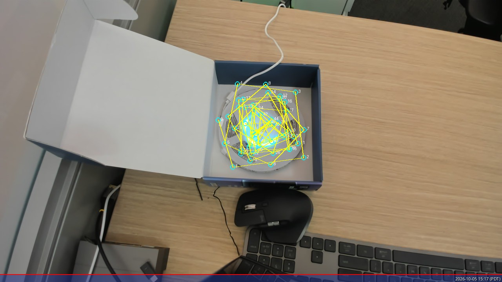 |

The strip order spirals inward in ~15 turns, so each winding holds only 3–4
points. Polar-native patterns (rings, spokes, wedges) therefore read best;
freeform 2-D shapes are honest 50-LED constellations.

### Static patterns

| heart | star | smiley | bolt |
|---|---|---|---|
| 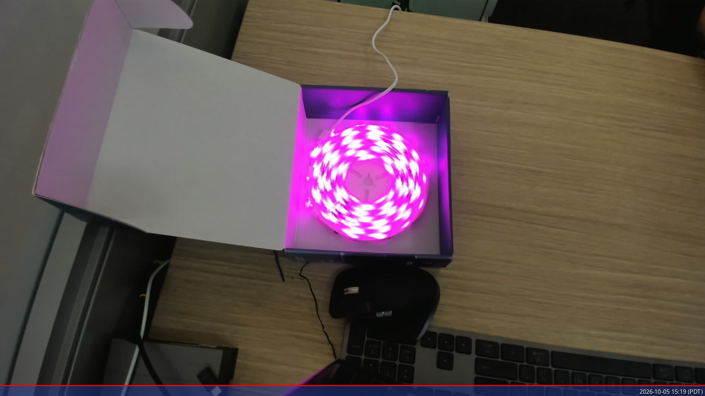 | 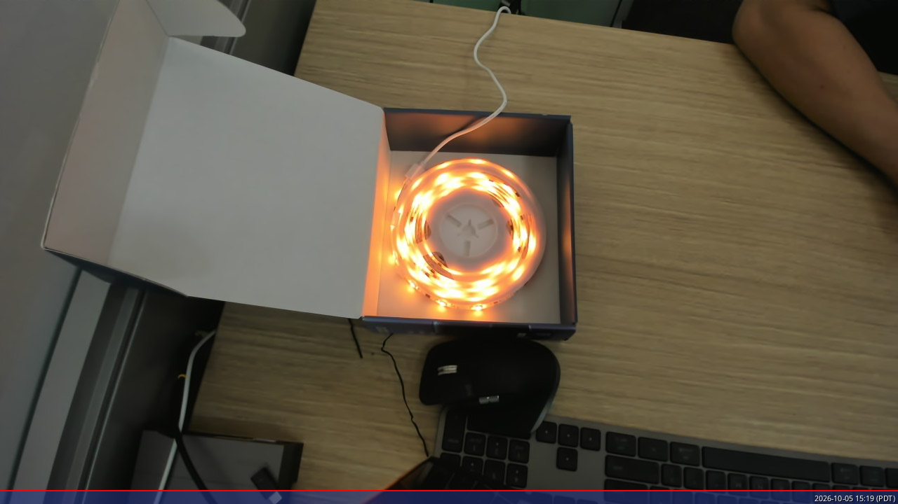 | 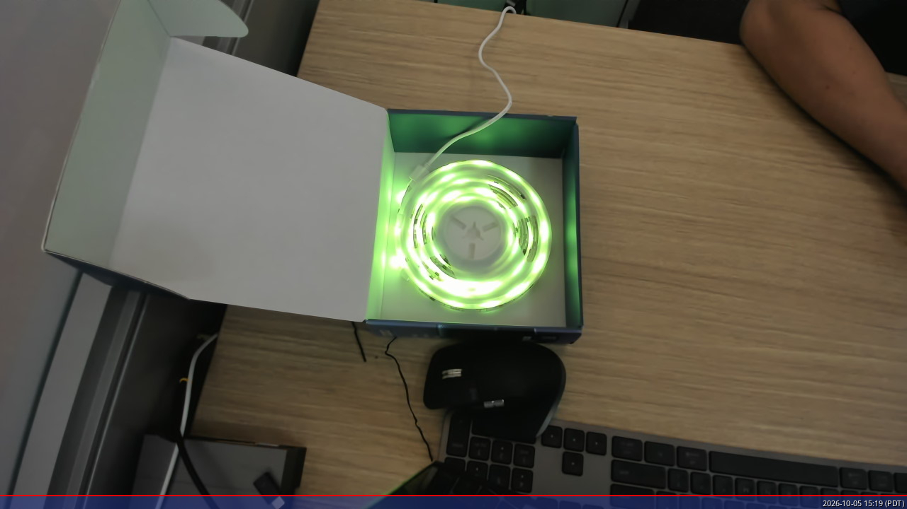 | 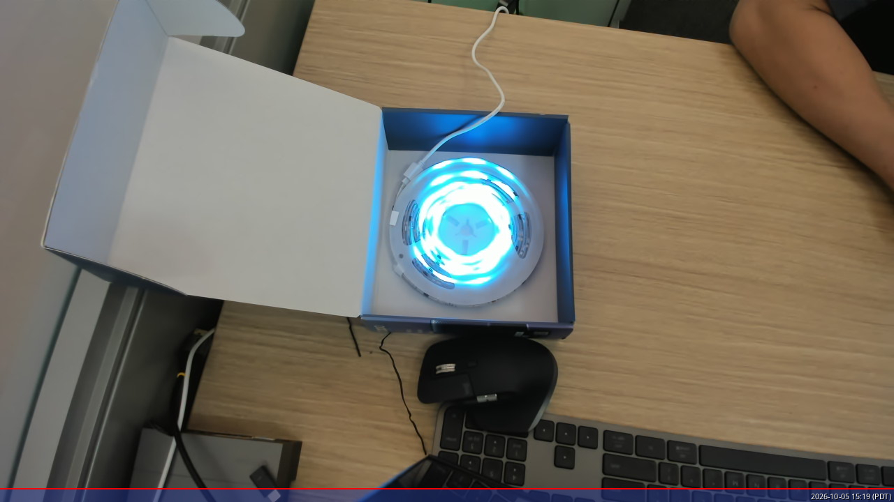 |

| compass spokes | target rings | pac-man |
|---|---|---|
| 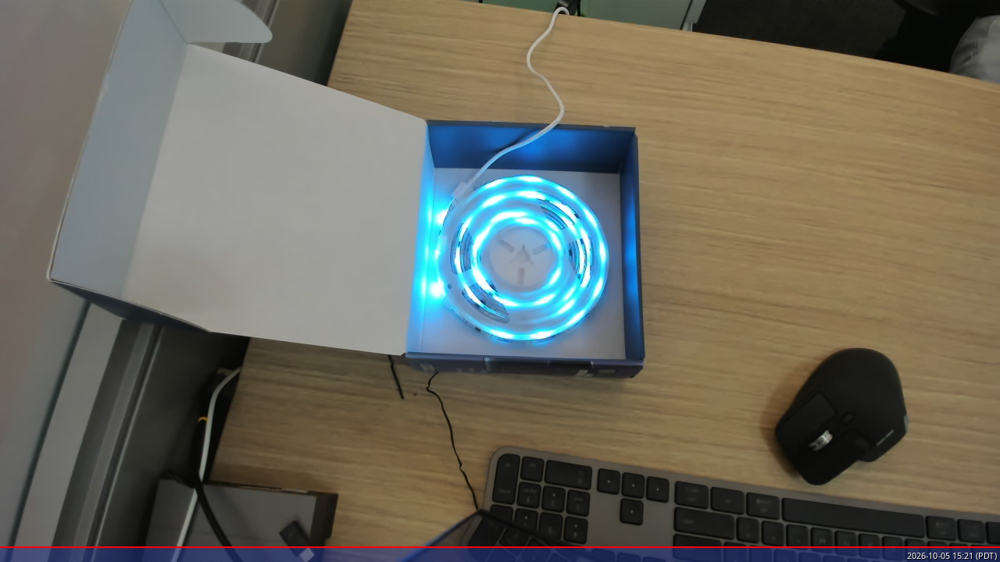 | 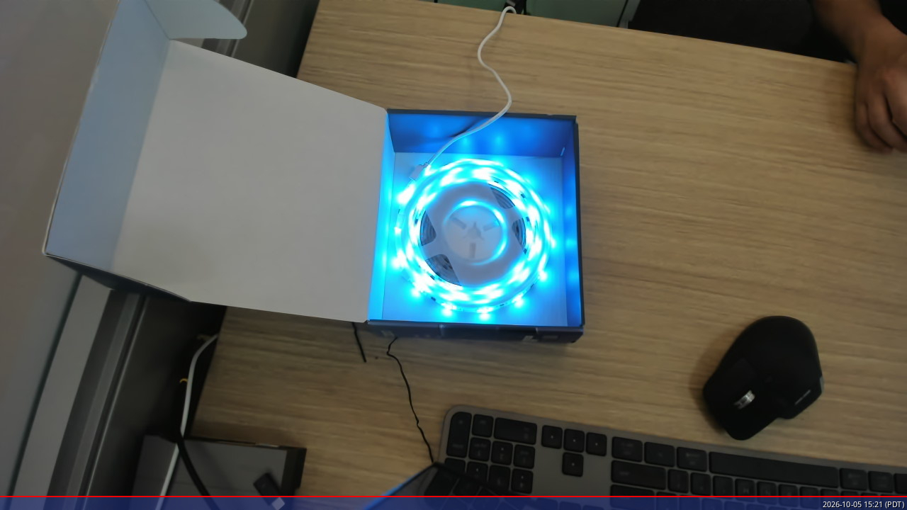 | 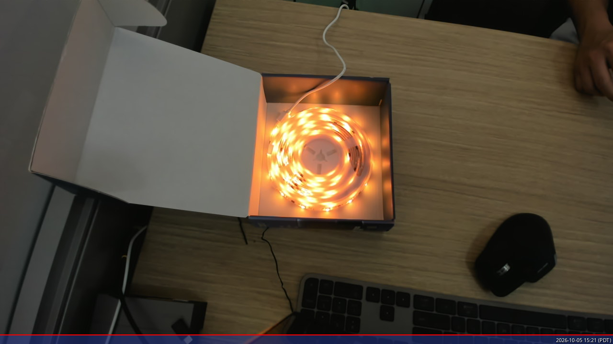 |

### Animations

The strip's segment order *is* the spiral path, so anything that animates
along it looks like a comet winding through the coil. Captured via the
webcam at 12 frames:

| 🐍 snake — rainbow comet chasing the spiral | 📡 radar — green beam sweeping around |
|---|---|
| 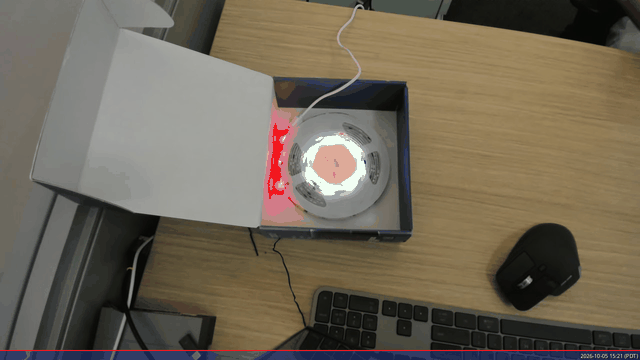 | 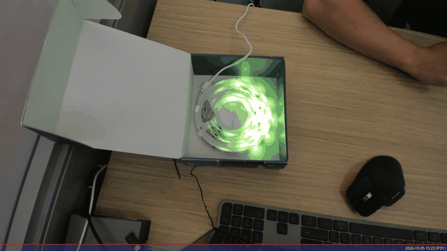 |

| 🪐 planet — body + fading trail orbiting a middle winding | 🕐 clock — real hour hand + sweeping minute hand + hub |
|---|---|
| 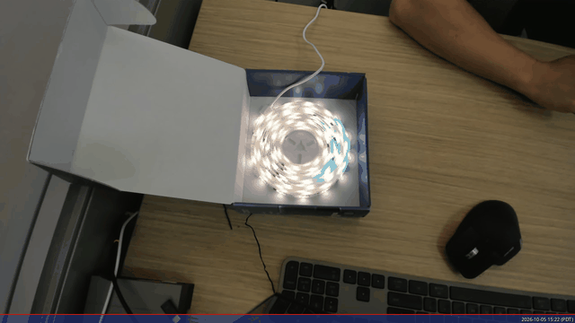 | 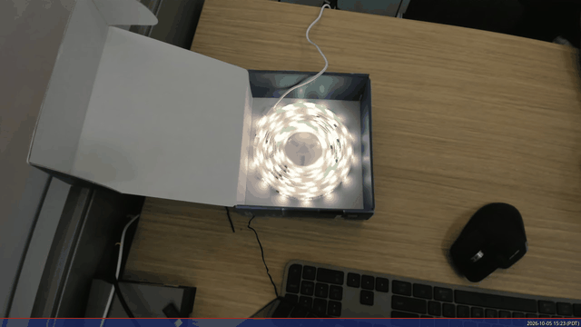 |

(+ `twinkle` — random starfield shimmer.)

### Running it yourself

```bash
PY=/path/to/tapo_env/bin/python   # a python with requests/cryptography/ecdsa/numpy/Pillow
export TPAP_HOST=device-ip TPAP_PORT=80 TPAP_TLS=0
export TPAP_USER=<tapo email> TPAP_PASS=<tapo password>

# one-off webcam calibration (camera pointed at the coil; CAM device + ROI
# in the script are tuned to the original angle — adjust for your setup)
$PY coil/calibrate_markers.py

# then draw (from the repo root)
$PY coil/draw.py static              # all four freeform shapes + photos
$PY coil/draw.py show pacman         # push one static shape, leave it
$PY coil/draw.py anim snake          # 12-frame GIF of an animation
$PY coil/draw.py off                 # dim everything
```

Shapes are defined in normalized coil space (u,v ≈ −1…1, v down), so new
pictures are just a mask/circle function over the measured points — e.g. a
clock, an orbit, or text rendered with the segments.

### Real-time clock (`coil/coil_clock.py`)

The coil makes a surprisingly good **persistent clock**: bright hub at the
center, blue hour hand (inner windings), green minute hand (outer 55%), and
an amber second marker on the outer ring. Each hand is the nearest LED to the
true clock angle, so resolution is the LED spacing (~±10 min on the minute
hand — that is the resolution of a 50-LED clock). It pushes only when the lit
set changes (a few times per minute), well under the ~6 updates/sec ceiling.

Live, service-driven photo (hands at the actual wall-clock time, coil propped
face-on and aligned to the hand-written **12** and **6** marks — here it
reads 4:12, so the minute dot sits at ~1 o'clock and the hour dot at ~4):

| Live coil clock |
|---|
| 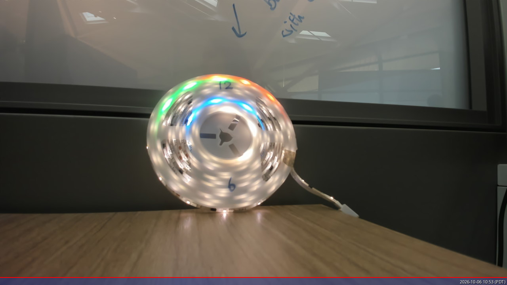 |

### Aligning the clock to the physical 12

The clock face only matches the reel if the software knows where **12
o'clock** is on it. Write "12" and "6" on the coil (they should sit on a
diameter), then:

```bash
$PY coil/align_clock.py        # dark frame -> detects both marks -> clock_ref.npy
```

It takes the midpoint of the two marks as the disc center and the vector to
the "12" mark as the 12-o'clock direction (averaging the two angles is
unstable at ~180 deg separation, so it doesn't). `coil_clock.py` reads
`clock_ref.npy` and uses the mark-based center for its geometry. Re-run it
after moving the coil or the camera.

**Calibration gotchas** (both hit on this setup, both fixed):

1. A bright **window behind** the coil also reads as a big bright low-sat
   region, so any "detect the disc" heuristic picks up the window. The
   cyan marker is *high*-saturation, so a hue+saturation filter with a
   blob-size cap is the robust path (the disc mask was dropped).
2. A few missed segments (occlusion/reflection) leave NaN rows in
   `segmap.npy`; `np.max()` propagates NaN through the whole normalization
   and silently wipes every mask. Both `coil_clock.py` and `draw.py`
   therefore normalize over the valid rows only, and `nearest()` just gets
   a few fewer candidates.

Run it persistently as a systemd user service (survives reboots, restarts on
crash, re-authenticates on error):

```bash
cat > ~/.config/systemd/user/coil-clock.service <<'EOF'
[Unit]
Description=L930 coil real-time clock (hour/minute/second hands on the spiral)
After=network-online.target
StartLimitIntervalSec=0

[Service]
Type=simple
Environment=TPAP_HOST=device-ip
Environment=TPAP_PORT=80
Environment=TPAP_TLS=0
ExecStart=<venv-python> <repo>/coil/coil_clock.py
Restart=always
RestartSec=3
StandardOutput=journal
StandardError=journal

[Install]
WantedBy=default.target
EOF
systemctl --user daemon-reload
systemctl --user enable --now coil-clock
journalctl --user -u coil-clock -f    # watch it push
```

`coil_clock.py` reads `TPAP_USER`/`TPAP_PASS` from the environment, falling
back to the `TAPO_MCP_USERNAME`/`TAPO_MCP_PASSWORD` lines of
`~/.openclaw/settings/tapo-mcp.env` (same as the ambient demos).
`python coil/coil_clock.py off` dims the strip and exits.

## Ambient demos (`demos/`)

Self-contained demo scripts for the L930 (best when the strip is wound in a
spiral/coil). Each runs until killed, then leaves the strip dim:

```bash
PY=/path/to/tapo_env/bin/python   # a python with requests/cryptography/ecdsa

# smooth "lub-dub" heartbeat, 6fps, peak 20% (time-locked pacing; the wire
# ceiling is ~6 updates/sec because each frame is one encrypted round-trip)
$PY demos/heartbeat_pattern.py    # --peak 40  --hue 100  --ticks 300

# comet chasing around the coil, one revolution ~10s
$PY demos/spiral_pattern.py       # --hue 100  --tail 8  --ticks 100
```

They work from any cwd (they locate `tpap_proto.py` relative to the repo).

For a **persistent** ambient (survives reboots and is independent of any
shell), run a demo under systemd the same way `nvidia-light` does, e.g.:

```ini
# ~/.config/systemd/user/strip-heartbeat.service
[Unit]
Description=L930 strip heartbeat - smooth red lub-dub ambient
After=network-online.target
StartLimitIntervalSec=0

[Service]
Type=simple
Environment=TPAP_HOST=device-ip
Environment=TPAP_PORT=80
Environment=TPAP_TLS=0
ExecStart=<venv-python> <repo>/demos/heartbeat_pattern.py
Restart=always
RestartSec=3
StandardOutput=journal
StandardError=journal

[Install]
WantedBy=default.target
```

```bash
systemctl --user daemon-reload
systemctl --user enable --now strip-heartbeat
journalctl --user -u strip-heartbeat -f   # watch it
```

Credentials: `TPAP_USER`/`TPAP_PASS` env vars, falling back to the
`TAPO_MCP_USERNAME`/`TAPO_MCP_PASSWORD` lines of
`~/.openclaw/settings/tapo-mcp.env` (the same file tapo-mcp uses).

### Built-in presets

`presets.py` carries all 55 app-defined effect templates with their
device-side IDs (e.g. `TapoStrip_...`), parsed from the `tapo` crate source
and verified live on an L930-5(US): `siren`, `fireworks`, `volcano`, `star`,
`candlelight`, `halloween`, `disco`, `dancing`, `electro_dance`, `bonfire`,
`dreamland`, `universe`, `movie`, `game`, `forest`, `snow`, and 40 more —
see `strip_effects.py list`.

Presets use `custom: 0` (the device looks them up by ID). Colors in
`display_colors` are `[hue, saturation, brightness, 0]`, hue 0–360.

## Per-segment "color painting" (the L930's real superpower)

The L930/L920 strips have **50 addressable segments** and accept custom
per-segment effects via `apply_segment_effect_rule` with `custom: 1`.
Verified device rules (L930-5 US, fw 1.4.3):

- **`segments` must be cumulative band-end indices** — e.g. 5 even bands over
  50 segments → `[9, 19, 29, 39, 49]`; full resolution (one color per
  segment) → `[0, 1, …, 49]`. Passing a single count (e.g. `[300]`) is
  rejected.
- **`display_colors` must have ≤ 4 entries** — 5 or more returns
  **`error_code -1008 PARAMS`** (the "PARAMS" error; the device gives no more
  detail).
- **`states`** is one `[hue, sat, bri, 0]` per band.
- **Use a fixed `id`** (e.g. `TapoStrip_screensync`): the device then updates
  colors **in place with no restart/blink**. A fresh id each call re-creates
  the effect and produces a visible flash.
- Effect type `none` = static custom painting. (`chasing`/`breathe` etc.
  exist but the static path is what per-segment rendering needs.)

```python
import strip_effects
st = strip_effects.Strip()
# one color per segment: full rainbow
st.rainbow()
# or manual:
ends = [9, 19, 29, 39, 49]                    # 5 even bands
states = [[100,100,90,0],[60,100,90,0],
          [25,100,90,0],[25,100,90,0],[25,100,90,0]]
st.custom("my-scene", 90, ends, states)
```

**Performance ceiling:** each update is one encrypted round-trip (measured
155–200 ms on LAN; 1-band whole-strip payloads are fastest), so the
practical rate is **~5–6 updates/sec** with time-locked pacing. Smooth
flowing gradients are not achievable on this hardware; calm,
slowly-changing ambient content (screen-sync ambilight, GPU-state
gradients, the `demos/`) works beautifully. Smooth flowing gradients are not achievable on this hardware;
calm, slowly-changing ambient content (screen-sync ambilight, GPU-state
gradients) works beautifully.

## Method names are snake_case

TPAP methods are **snake_case**: `get_device_info`, `get_device_usage`,
`get_current_power`, `set_device_info`, `apply_segment_effect_rule`,
`set_lighting_effect`. Using camelCase (`getDeviceInfo`) returns
`error_code -1002`. (Bug fix 2026-10-05: the raw client's no-arg default was
`getDeviceInfo`, which fails — it now defaults to `get_device_info`.)

## Flat `set_device_info` params (color bulbs & strips)

For RGB/RGBIC devices, set color with `set_device_info` and a **flat** param
object — the same shape the `tapo` Rust builder
(`ColorLightSetDeviceInfoParams`) serializes:

```json
{"device_on": true, "brightness": 100, "hue": 25, "saturation": 100, "color_temp": 0}
```

Do **not** wrap it in `{"state": {...}}`. The wrapped form is accepted with
`error_code 0` but the device silently ignores it (state does not change).
Hue is 0–360, saturation 1–100, `color_temp` 2500–6500 (set `0` when using
hue/saturation). Setting hue/saturation also turns the device on and clears
any active lighting effect.

## Troubleshooting

- **`pake_share` fails with `error_code -2203`** (and `failedAttempts` /
  `remainAttempts`): that is a SPAKE2+ confirmation mismatch — treat it as a
  **wrong credential**, not a crypto bug. The recurring real cause is a
  shell-mangled password from `source .env` (quotes, `!`, `$`, whitespace).
  Pass the exact bytes as the env var:
  `P=$(grep -E '^TAPO_MCP_PASSWORD=' <envfile> | cut -d= -f2-)`, then
  `TPAP_PASS=*** — do not `source` the file. Verify before blaming the
  protocol: `printf '%s' "$P" | wc -c` (length) and
  `tr -d '\11\12\15\40-\176' | wc -c` (non-printing chars = 0).
  **Each failed `pake_share` consumes one of the device's limited login
  attempts**, so get the bytes right before retrying.

- **`error_code -1008 PARAMS` on `apply_segment_effect_rule`**: wrong
  payload shape — check the cumulative `segments` indices and the ≤4
  `display_colors` cap above.

- **`error_code -1002`**: camelCase method name; use snake_case.

- **`FORBIDDEN` from the normal `tapo`/`tapo-mcp` path**: device-side
  protocol gap (TPAP), not a container or network bug. Use this client.

- **Wrong port / TLS**: honor the discovery `tpap.port` / `tpap.tls`. A
  P115 uses port 80 plain HTTP; other devices may use 443 + TLS.

- **Works in the app ≠ local access is on**: the app drives devices via the
  cloud path. Local access is a separate protocol negotiation.

## Wire protocol (summary)

1. `discover`: `POST /` `{"method":"login","params":{"sub_method":"discover"}}` →
   `result.mac`, `result.tpap.pake[]`. pake code → `passcode_type`:
   `0`→`default_userpw`, `2`→`userpw`, `3`→`shared_token`.
2. `pake_register`: `{"sub_method":"pake_register", username: md5hex("admin"),
   user_random: b64(32 random bytes), cipher_suites:[1],
   encryption:["aes_128_ccm","chacha20_poly1305","aes_256_ccm"],
   passcode_type, stok:null}` → `result.{extra_crypt, encryption, dev_random,
   dev_salt, dev_share, cipher_suites, iterations}`.
3. Credential derivation from `extra_crypt` (`password_shadow`
   `passwd_id` 2/3, or `password_sha_with_salt`).
4. **SPAKE2+ on P-256** with SEC1 points `M`/`N`; PBKDF2-HMAC-SHA256 to
   `(a,b)`, then `w=a%n`, `h=b%n`, `x` random; compute `L, R, Rp, Z, V`; build
   the transcript; derive confirmation + shared keys via HKDF; compare
   `user_confirm` vs the device's `dev_confirm`.
5. `pake_share`: `{"sub_method":"pake_share", user_share: b64(L),
   user_confirm}` → `result.{dev_confirm, start_seq, expired, stok}`.
6. **Session**: derive an AEAD key + base nonce from the shared secret via
   HKDF (per-cipher labels); requests are `u32be(seq) ‖ AEAD(JSON)`, posted
   to `/stok=<stok>/ds` as `application/octet-stream`; `seq` increments after
   each request. Response `rseq` is in the first 4 bytes; decrypt with the
   response's `rseq`.

## Upstream

This closes the local-control gap for TPAP devices pending upstream support
in the `tapo` crate (see mihai-dinculescu/tapo issue #657).

## Changelog

- **2026-10-06**: fixed disappearing clock hands. Two geometry bugs, not
  rounding: (1) `nearest()` had a 25.8deg distance cutoff, but the spiral
  windings have angular gaps up to 109deg in the outer ring, so the second
  hand fell into a dead zone and vanished ~17% of the day; (2) the hand
  bands overlap, so when two hands targeted the same LED the write order
  (hour then minute then second) let the dim second clobber the bright
  minute. Fix: no distance cutoff (a hand is at worst ~22deg off, never
  missing), the second band widened to R>0.58 (21 LEDs, 44deg max gap),
  and collision-aware placement - each hand takes the nearest *free* LED
  (minute first, then second, then hour), so all three stay visible even
  at :00. Verified: full-day simulation, 0 missing hands, 0 collisions.

- **2026-10-05**: re-oriented the coil (now propped face-on like a clock
  dial) and re-aligned: re-ran `calibrate_markers.py` (44/50 points; the
  disc-masking heuristic was dropped because a bright window behind the
  coil defeated it - the cyan marker's high saturation is the robust
  filter), added `align_clock.py` which reads the hand-written 12/6 marks
  to set the clock face orientation (`clock_ref.npy`), and made
  `coil_clock.py`/`draw.py` tolerate missed (NaN) calibration points.

- **2026-10-05**: added `coil/coil_clock.py` — a persistent real-time clock on
  the coil (hub + blue hour hand + green minute hand + amber second marker,
  push-on-change pacing, re-auth on error), verified live against the wall
  clock and running as `coil-clock.service` (systemd user service).

- **2026-10-05**: added `coil/` — webcam-driven constellation demos for a
  coil-wound L930. `calibrate_markers.py` maps all 50 segments to pixel
  positions (single-cyan-marker + webcam, verified 50/50); `draw.py` rasterizes
  shapes in image space and lights the segments that fall inside. Seven static
  patterns (heart, star, smiley, bolt, spokes, target, pac-man) and five
  animations (snake, radar, twinkle, planet, clock), each verified by photo/GIF
  in `coil/media/`.

- **2026-10-05**: ambient demos can now run as systemd user services
  (persistent, restart-on-failure); `demos/heartbeat_pattern.py` picks up
  Tapo credentials from the tapo-mcp env file when `TPAP_USER`/`TPAP_PASS`
  are not set.

- **2026-10-05**: reorganized: ambient demo scripts moved into `demos/`
  (`heartbeat_pattern.py`, `spiral_pattern.py`); their imports now work from
  any cwd. Heartbeat got smooth time-locked 6fps pacing, 1-band payloads,
  and a 20%-brightness peak (measured: ~155 ms 1-band round-trip).

- **2026-10-05**: added `heartbeat_pattern.py` (lub-dub pulse, verified
  live) and `spiral_pattern.py` (comet-chase demo; both verified live on a
  coil-wound strip).

- **2026-10-05**: fixed the raw client's no-arg default method
  (`getDeviceInfo` → `get_device_info`; the old default fails with -1002).
  Added `strip_effects.py` (single-session helper) and `presets.py` (all 55
  built-in strip effects with verified device-side IDs). Documented the
  per-segment "color painting" protocol: 50 segments, cumulative band-end
  indices, ≤4 display colors (-1008), fixed id for blink-free in-place
  updates, ~4–5 updates/sec ceiling.
